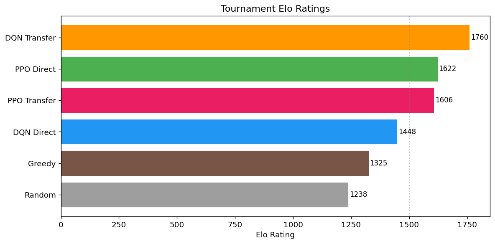
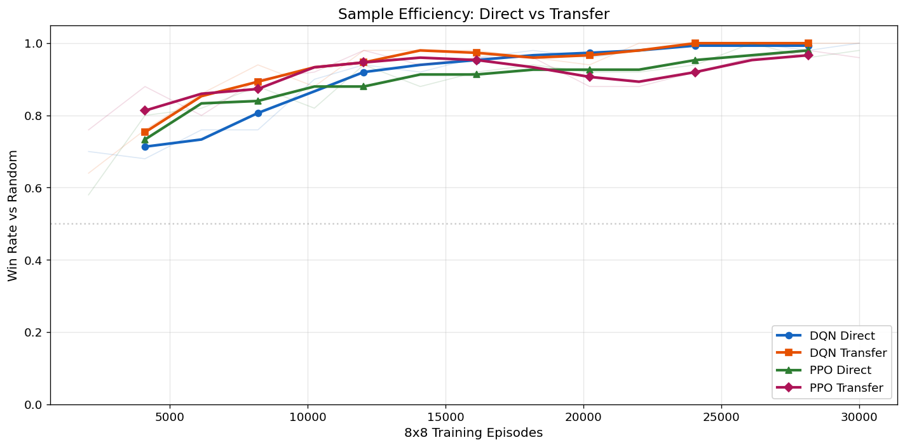
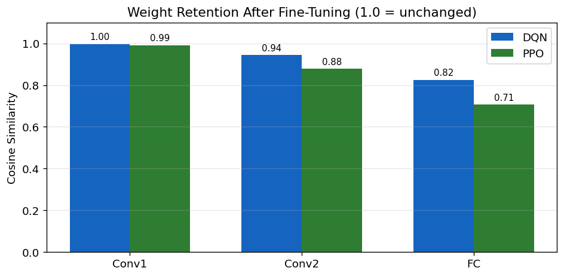
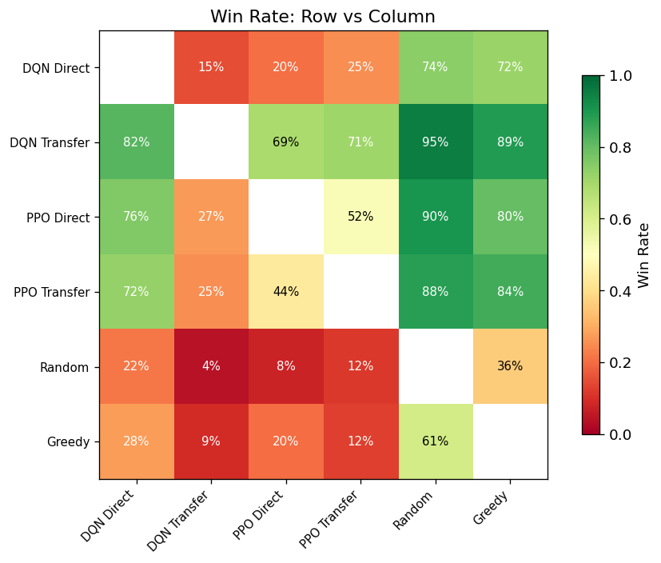

# Othello-RL: Transfer Learning — DQN vs PPO

Does pretraining a reinforcement-learning agent on a small board help it learn a bigger
version of the same game faster? This project trains DQN and PPO agents to play Othello
from self-play, then tests whether weights learned on a 6×6 board transfer to 8×8.

Full writeup, code, and all experiments: [`notebook.ipynb`](notebook.ipynb).

## Setup

- Custom Othello environment (`othello/env.py`, `othello/env_kernels.py`), Numba-JIT'd for speed
- Two algorithms trained from scratch via self-play: **DQN** and **PPO**, each sharing a CNN
  backbone with an adaptive-pooling layer so conv weights are portable between board sizes
- Four agents compared: `DQN Direct` (trained only on 8×8), `DQN Transfer` (pretrained on
  6×6, fine-tuned on 8×8), and the same pair for PPO
- Evaluated in a 6-agent round-robin tournament (200 games/matchup) against `Greedy` and
  `Random` baselines, ranked by Elo (iterative MLE)

## Results

**Final standings** (1,200 games):

| Agent | Elo | Win rate | W / D / L |
|---|---|---|---|
| DQN Transfer | 1760 | 81.2% | 812 / 28 / 160 |
| PPO Direct | 1622 | 64.9% | 649 / 30 / 321 |
| PPO Transfer | 1606 | 62.7% | 627 / 30 / 343 |
| DQN Direct | 1448 | 41.2% | 412 / 30 / 558 |
| Greedy | 1325 | — | 260 / 18 / 722 |
| Random | 1238 | — | 161 / 22 / 817 |



**Transfer learning helped DQN, not PPO.** Pretraining on 6×6 then fine-tuning on 8×8 gave
DQN a **+312 Elo** boost over training from scratch, and let it hit an 80%-win-rate-vs-random
threshold in 6,144 episodes instead of 10,240 (40% fewer). PPO showed the opposite: transfer
gave it **‑16 Elo** and no change in episodes-to-threshold — it's already sample-efficient
enough on-policy that the pretrained features added nothing.



**Why the split?** DQN starts from random weights and a cold replay buffer, so a useful
initialisation matters a lot early on. PPO's on-policy updates already adapt quickly, so
there's less room for a head start to help — and the plot below shows PPO's fine-tuning
overwrites more of the transferred weights than DQN's does, consistent with PPO relying on
its own features rather than the imported ones.



**Win-rate matrix** across all six agents:



## Cost vs. benefit

Transfer agents play an extra 20,000 games on 6×6 (about 12,000 8×8-equivalent games, since
the smaller board runs ~40% faster per episode). For that overhead, DQN gained +312 Elo and
PPO lost 16 — transfer learning here is a good deal for one algorithm and a wash for the
other, not a free win across the board.

## Repro

```
pip install -r requirements.txt
jupyter notebook notebook.ipynb
```
